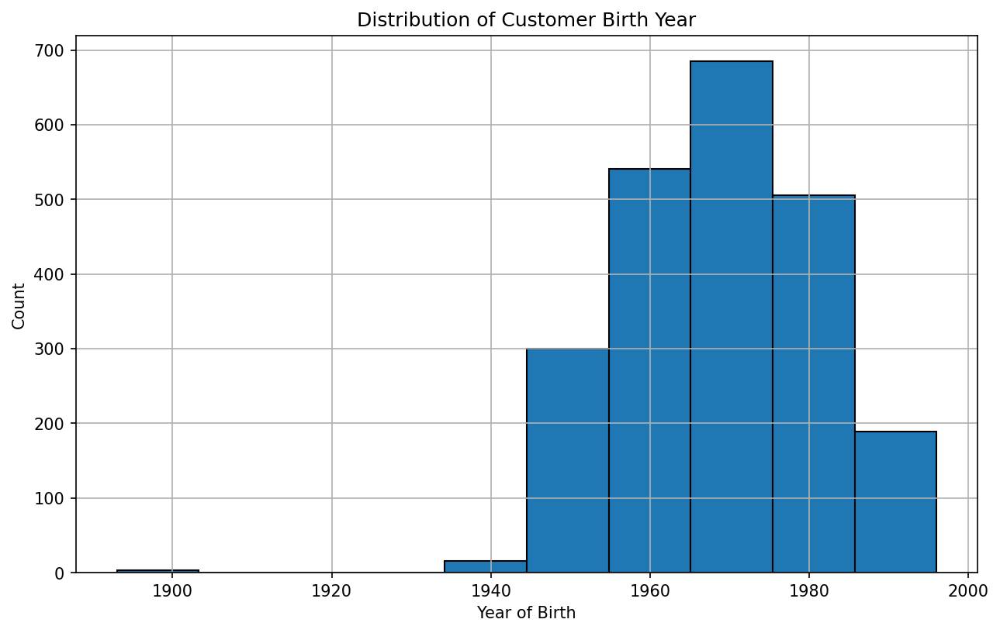
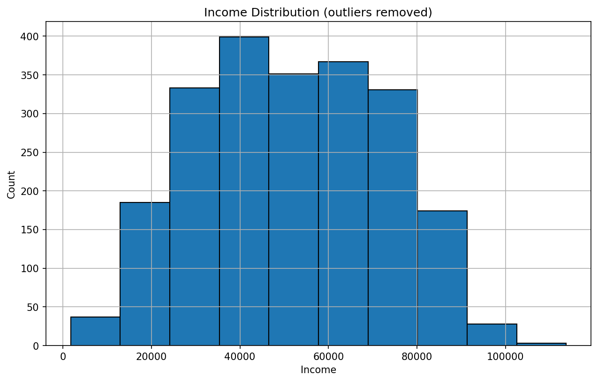
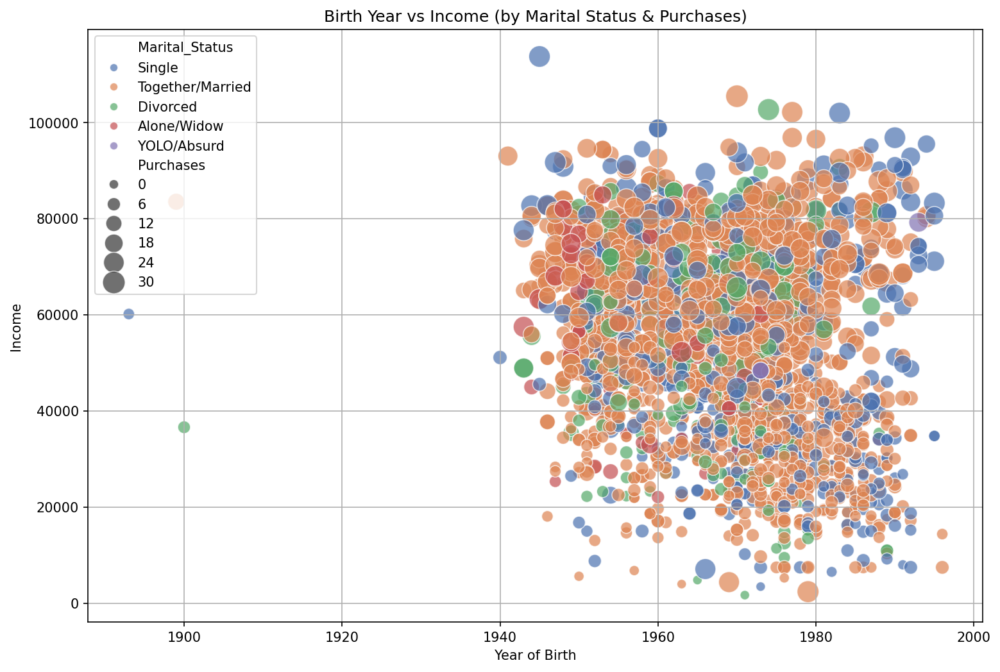
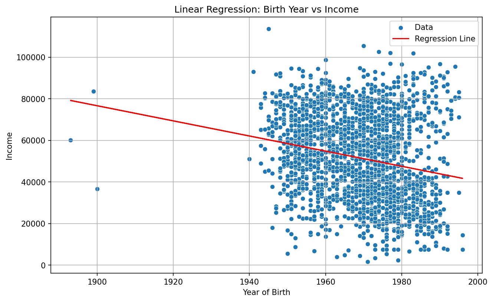
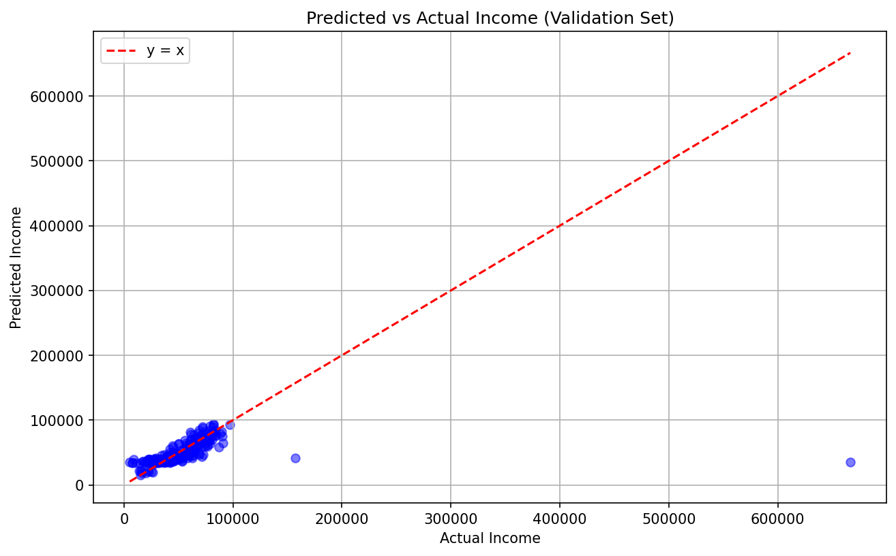
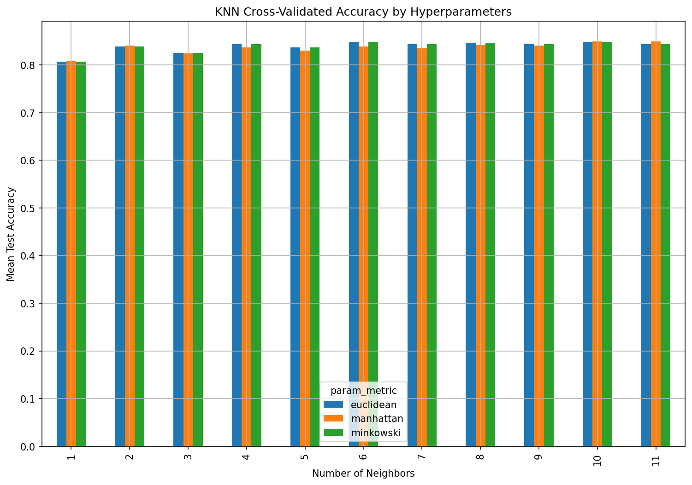
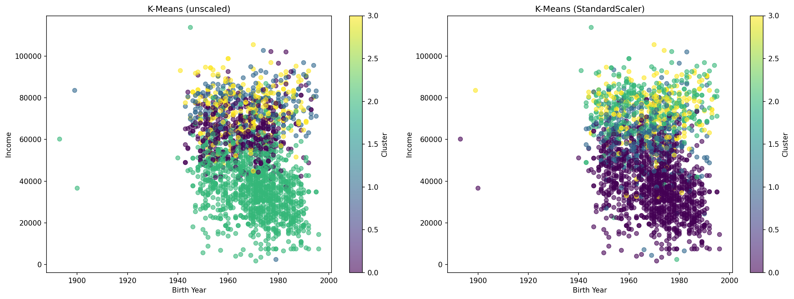

# Customer Personality Analysis

## Project Objective

A retail company maintains a dataset of 2,240 customers covering demographics, spending habits, campaign responses, and purchase channels. The goal of this project is to answer three business questions:

1. **Who are our customers?** What do their age, income, and spending patterns look like?
2. **Can we predict customer behavior?** Specifically, can we estimate income from spending data, and predict whether a customer will respond to a marketing campaign?
3. **Can we segment customers into meaningful groups?** What distinct spending profiles exist, and how should the company target each segment?

## Methods

| Stage | Technique | Tools |
|-------|-----------|-------|
| Data cleaning | Outlier removal, missing value handling, feature engineering | pandas, NumPy |
| Exploratory analysis | Distribution analysis, cross-tabulation, multi-variable visualization | matplotlib, seaborn |
| Regression | Simple & multiple linear regression with preprocessing pipelines | scikit-learn (LinearRegression, ColumnTransformer, Pipeline) |
| Classification | Logistic Regression, KNN with GridSearchCV (5-fold CV) | scikit-learn (LogisticRegression, KNeighborsClassifier) |
| Clustering | K-Means (k=4), scaled vs. unscaled comparison | scikit-learn (KMeans, StandardScaler) |

## Analysis & Results

### 1. Exploratory Analysis — Understanding the Customer Base

**Question:** What does our customer base look like in terms of age, income, and purchase behavior?

#### Birth Year Distribution



**Why this chart:** A histogram reveals the age composition of the customer base at a glance, showing whether the company serves a young, middle-aged, or older demographic.

**Finding:** The majority of customers were born between 1960 and 1980 (mean = 1969, std = 12). The company's core audience is middle-aged adults, likely with stable income and established purchasing habits. A few outlier records (born before 1900) suggest data entry errors.

#### Income Distribution



**Why this chart:** After removing extreme outliers (income > $130,000), the histogram shows a roughly normal distribution, which validates income as a useful feature for modeling.

**Finding:** Most customers earn between $20,000 and $80,000, with a peak around $30,000–$50,000. Income was binned into four quartile-based groups (Low, Lower-mid, Upper-mid, Upper) for downstream analysis.

#### Multi-Dimensional Customer Profile



**Why this chart:** A scatter plot encoding four variables (birth year on x-axis, income on y-axis, marital status as color, total purchases as dot size) allows us to spot patterns across multiple dimensions simultaneously.

**Finding:** Higher-income customers tend to make more purchases (larger dots cluster toward the top). Marital status is fairly evenly distributed across income levels; no single group dominates spending. Several young, high-income single customers stand out as potential high-value targets.

---

### 2. Regression — Predicting Customer Income

**Question:** Can we predict a customer's income based on their spending patterns?

#### Birth Year vs. Income



**Why this chart:** A scatter plot with a regression line makes it easy to see both the direction and the strength (or weakness) of a linear relationship.

**Finding:** The slope is –364, meaning income decreases by ~$364 for each year more recently a customer was born. However, the scatter is very wide — birth year alone is a poor predictor of income. This motivates using product spending as features instead.

#### Predicted vs. Actual Income (Extended Model)



**Why this chart:** A predicted-vs-actual scatter plot is the standard way to evaluate a regression model. Points close to the red y=x line indicate accurate predictions; deviations reveal systematic errors.

**Finding:** The extended model (6 spending features + birth year + education + marital status, with StandardScaler and OneHotEncoder) performs well for customers in the $20k–$100k range, where predictions cluster tightly around the y=x line. However, two extreme outliers (income > $150k) are badly under-predicted, pulling up the RMSE. For the core customer base, the model is reasonably useful.

---

### 3. Classification — Predicting Campaign Response

**Question:** Can we predict whether a customer will respond to the next marketing campaign?

Two models were compared:
- **Logistic Regression** using prior campaign acceptance (AcceptedCmp1–5) and number of deal purchases → Test accuracy: **84.6%**
- **KNN with GridSearchCV** using spending amounts and purchase channel features → Best CV accuracy: **85.0%**

#### KNN Hyperparameter Search



**Why this chart:** A grouped bar chart comparing accuracy across all hyperparameter combinations (n_neighbors × distance metric) makes it easy to identify the best configuration and understand sensitivity.

**Finding:** The best model uses **k=10 with Manhattan distance** (85.0% accuracy). Performance is stable across most configurations (80–85%), suggesting the model is not overly sensitive to hyperparameter choices. However, the classification report reveals a key limitation: while the model correctly identifies 99% of non-responders, it only catches 7% of actual responders (recall = 0.07 for class 1). The dataset is heavily imbalanced (only 15% responded), so accuracy alone is misleading — the model essentially defaults to predicting "no response."

---

### 4. Clustering — Customer Segmentation

**Question:** Can we group customers into distinct spending segments that the marketing team can act on?



**Why this chart:** Side-by-side scatter plots compare K-Means results with and without feature scaling. This highlights how StandardScaler changes cluster assignments by equalizing the influence of each spending category.

**Why two versions:** Without scaling, K-Means is dominated by the highest-variance features (wine and meat spending). With scaling, all six product categories contribute equally, producing more balanced and interpretable segments.

**Segments identified (scaled model):**

| Cluster | Wine | Fruits | Meat | Fish | Sweets | Gold | Profile |
|---------|------|--------|------|------|--------|------|---------|
| 0 | $85 | $6 | $34 | $12 | $6 | $16 | **Low spenders** — minimal engagement across all categories |
| 1 | $576 | $22 | $222 | $50 | $21 | $92 | **High spenders (wine + gold)** — premium buyers with broad spending |
| 2 | $656 | $45 | $371 | $77 | $57 | $50 | **High spenders (wine + meat)** — food-focused premium customers |
| 3 | $506 | $108 | $309 | $137 | $99 | $104 | **Balanced high spenders** — highest fruit/fish/sweet spending |

---

## Conclusions

1. **Customer demographics:** The company's core customers are middle-aged adults (born 1960–1980) with incomes in the $20k–$80k range. Marketing strategies should prioritize this demographic.
2. **Income prediction:** Product spending patterns are a better predictor of income than age alone. The extended regression model performs well for the majority of customers but struggles with extreme income values.
3. **Campaign targeting needs work:** Both classification models achieve ~85% accuracy, but this is driven by the majority class. To improve campaign targeting, the company should address class imbalance (e.g., oversampling responders, adjusting decision thresholds) or shift to metrics like F1-score and precision-recall curves.
4. **Four customer segments** were identified. The low-spender group (Cluster 0) represents the largest segment and may benefit from engagement campaigns, while the three high-spending clusters can be targeted with differentiated product promotions (wine-focused, food-focused, or broad premium offers).

## How to Run

```bash
pip install -r requirements.txt
python customer_personality_analysis.py
```

Figures are saved to the `figures/` directory.

## Tech Stack

pandas, NumPy, matplotlib, seaborn, scikit-learn

## Project Structure

```
customer-analysis/
├── customer_personality_analysis.py
├── figures/
│   ├── 01_birth_year_distribution.png
│   ├── 02_income_raw.png
│   ├── 03_income_cleaned.png
│   ├── 04_campaign_acceptance.png
│   ├── 05_purchases_distribution.png
│   ├── 06_multidim_scatter.png
│   ├── 07_birth_year_regression.png
│   ├── 08_predicted_vs_actual.png
│   ├── 09_knn_gridsearch.png
│   └── 10_kmeans_clustering.png
├── requirements.txt
├── README.md
└── .gitignore
```
